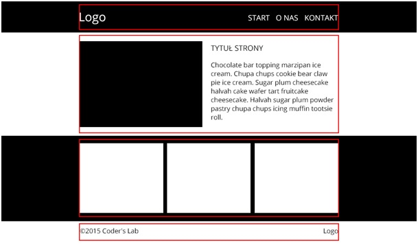

# CSS – Podsumowanie - obowiązkowe

1. Stwórz następujący układ:

	

**Wskazówki**
* Podziel stronę odpowiednio (section, header, footer) 
* Czarne tło pod headerem oraz pod trzema boxami powinny być rozciągnięte na 100% szerokości strony.
* Linie czerwone przedstawione na powyższym przykładzie traktuj jako linie pomocnicze będące obramowaniem kontenera środkującego. Odpowiednio go nazwij np. main_width. 

